<div align="center">


*Learn each sort, know when to use it, then solve the questions built on top of it.*


</div>

> [!NOTE]
> All snippets assume `import java.util.*;` and a helper `swap(int[] a, int i, int j)`.

---

## 📑 Playlist Order

| # | Sort | Type |
|:-:|:--|:--|
| 1 | Bubble Sort | Comparison |
| 2 | Selection Sort | Comparison |
| 3 | Insertion Sort | Comparison |
| 4 | Merge Sort | Divide & Conquer |
| 5 | Quick Sort | Divide & Conquer |
| 6 | Heap Sort | Comparison (Heap) |
| 7 | Shell Sort | Comparison (Gap) |
| 8 | Counting Sort | Non-comparison |
| 9 | Radix Sort | Non-comparison |
| 10 | Bucket Sort | Non-comparison |

---

## ✨ Cheat Sheet

<div align="center">

| Sort | Best | Average | Worst | Space | Stable | In-place |
|:--|:-:|:-:|:-:|:-:|:-:|:-:|
| **Bubble** | `O(n)` | `O(n²)` | `O(n²)` | `O(1)` | ✅ | ✅ |
| **Selection** | `O(n²)` | `O(n²)` | `O(n²)` | `O(1)` | ❌ | ✅ |
| **Insertion** | `O(n)` | `O(n²)` | `O(n²)` | `O(1)` | ✅ | ✅ |
| **Merge** | `O(n log n)` | `O(n log n)` | `O(n log n)` | `O(n)` | ✅ | ❌ |
| **Quick** | `O(n log n)` | `O(n log n)` | `O(n²)` | `O(log n)` | ❌ | ✅ |
| **Heap** | `O(n log n)` | `O(n log n)` | `O(n log n)` | `O(1)` | ❌ | ✅ |
| **Shell** | `O(n log n)` | depends on gaps | `O(n²)` | `O(1)` | ❌ | ✅ |
| **Counting** | `O(n + k)` | `O(n + k)` | `O(n + k)` | `O(k)` | ✅* | ❌ |
| **Radix** | `O(d·(n + k))` | `O(d·(n + k))` | `O(d·(n + k))` | `O(n + k)` | ✅ | ❌ |
| **Bucket** | `O(n + k)` | `O(n + k)` | `O(n²)` | `O(n + k)` | ✅** | ❌ |

<sub>k = value range · d = number of digits · * with the prefix-sum version (the simple version below isn't stable) · ** if the inner sort is stable</sub>

</div>

> [!TIP]
> **Stable** = equal elements keep their original order. This matters when sorting objects by one key, and it's why Radix Sort needs a stable inner sort.

---

## 🧩 Which Sort for Which Situation

| Situation | Use |
|:--|:--|
| Almost sorted / tiny array | Insertion Sort |
| Need guaranteed `O(n log n)` + stable | Merge Sort |
| Need counting pairs while sorting | Merge Sort |
| Fast average, in-place, or Kth element | Quick Sort / Quickselect |
| Need `O(n log n)` with `O(1)` space | Heap Sort |
| Small integer range | Counting Sort |
| Many digits / fixed-width numbers | Radix Sort |
| Uniform floating-point values | Bucket Sort |

> [!IMPORTANT]
> **Java built-ins:** `Arrays.sort(int[])` uses Dual-Pivot Quicksort (not stable). `Arrays.sort(Object[])` and `Collections.sort` use TimSort (stable).

---

## 🧪 Sorting Methods — Code

<details>
<summary><b>1 · Bubble Sort</b> — swap adjacent pairs, largest bubbles to the end</summary>

<div align="center">
</div>

```java
public void bubbleSort(int[] a) {
    int n = a.length;
    for (int i = 0; i < n - 1; i++) {
        boolean swapped = false;
        for (int j = 0; j < n - 1 - i; j++) {
            if (a[j] > a[j + 1]) {
                swap(a, j, j + 1);
                swapped = true;
            }
        }
        if (!swapped) break;           // already sorted → O(n) best case
    }
}
```
</details>

<details>
<summary><b>2 · Selection Sort</b> — pick the minimum, place it at the front</summary>

<div align="center">
</div>

```java
public void selectionSort(int[] a) {
    for (int i = 0; i < a.length - 1; i++) {
        int min = i;
        for (int j = i + 1; j < a.length; j++) {
            if (a[j] < a[min]) min = j;
        }
        swap(a, i, min);
    }
}
```
</details>

<details>
<summary><b>3 · Insertion Sort</b> — insert each element into the sorted prefix</summary>

<div align="center">
</div>

```java
public void insertionSort(int[] a) {
    for (int i = 1; i < a.length; i++) {
        int key = a[i], j = i - 1;
        while (j >= 0 && a[j] > key) {
            a[j + 1] = a[j];
            j--;
        }
        a[j + 1] = key;
    }
}
```
</details>

<details>
<summary><b>4 · Merge Sort</b> — split, sort halves, merge</summary>

<div align="center">
</div>

```java
public void mergeSort(int[] a, int l, int r) {
    if (l >= r) return;
    int m = l + (r - l) / 2;
    mergeSort(a, l, m);
    mergeSort(a, m + 1, r);
    merge(a, l, m, r);
}

private void merge(int[] a, int l, int m, int r) {
    int[] t = new int[r - l + 1];
    int i = l, j = m + 1, k = 0;
    while (i <= m && j <= r) t[k++] = (a[i] <= a[j]) ? a[i++] : a[j++];   // <= keeps it stable
    while (i <= m) t[k++] = a[i++];
    while (j <= r) t[k++] = a[j++];
    System.arraycopy(t, 0, a, l, t.length);
}
```
</details>

<details>
<summary><b>5 · Quick Sort</b> — partition around a pivot (random pivot avoids the O(n²) trap)</summary>

<div align="center">
</div>

```java
private static final Random RNG = new Random();

public void quickSort(int[] a, int lo, int hi) {
    if (lo >= hi) return;
    int p = partition(a, lo, hi);
    quickSort(a, lo, p - 1);
    quickSort(a, p + 1, hi);
}

private int partition(int[] a, int lo, int hi) {
    swap(a, lo + RNG.nextInt(hi - lo + 1), hi);     // random pivot to the end
    int pivot = a[hi], i = lo;
    for (int j = lo; j < hi; j++) {
        if (a[j] < pivot) swap(a, i++, j);
    }
    swap(a, i, hi);
    return i;                                       // pivot's final index
}
```
</details>

<details>
<summary><b>6 · Heap Sort</b> — build a max-heap, repeatedly move the max to the end</summary>

<div align="center">
</div>

```java
public void heapSort(int[] a) {
    int n = a.length;
    for (int i = n / 2 - 1; i >= 0; i--) heapify(a, n, i);   // build max-heap
    for (int end = n - 1; end > 0; end--) {
        swap(a, 0, end);
        heapify(a, end, 0);
    }
}

private void heapify(int[] a, int n, int i) {
    while (true) {
        int l = 2 * i + 1, r = l + 1, big = i;
        if (l < n && a[l] > a[big]) big = l;
        if (r < n && a[r] > a[big]) big = r;
        if (big == i) return;
        swap(a, i, big);
        i = big;
    }
}
```
</details>

<details>
<summary><b>7 · Shell Sort</b> — insertion sort with shrinking gaps</summary>

<div align="center">
</div>

```java
public void shellSort(int[] a) {
    for (int gap = a.length / 2; gap > 0; gap /= 2) {
        for (int i = gap; i < a.length; i++) {
            int key = a[i], j = i;
            while (j >= gap && a[j - gap] > key) {
                a[j] = a[j - gap];
                j -= gap;
            }
            a[j] = key;
        }
    }
}
```
</details>

<details>
<summary><b>8 · Counting Sort</b> — count occurrences (non-negative ints, small range)</summary>

<div align="center">
</div>

```java
public void countingSort(int[] a) {
    int max = 0;
    for (int x : a) max = Math.max(max, x);
    int[] cnt = new int[max + 1];
    for (int x : a) cnt[x]++;
    int idx = 0;
    for (int v = 0; v <= max; v++) {
        while (cnt[v]-- > 0) a[idx++] = v;
    }
}
```
</details>

<details>
<summary><b>9 · Radix Sort</b> — LSD, stable counting sort on each digit</summary>

<div align="center">
</div>

```java
public void radixSort(int[] a) {
    int max = 0;
    for (int x : a) max = Math.max(max, x);
    for (int exp = 1; max / exp > 0; exp *= 10) countByDigit(a, exp);
}

private void countByDigit(int[] a, int exp) {
    int n = a.length;
    int[] out = new int[n], c = new int[10];
    for (int x : a) c[(x / exp) % 10]++;
    for (int i = 1; i < 10; i++) c[i] += c[i - 1];
    for (int i = n - 1; i >= 0; i--) out[--c[(a[i] / exp) % 10]] = a[i];   // right→left keeps stability
    System.arraycopy(out, 0, a, 0, n);
}
```
</details>

<details>
<summary><b>10 · Bucket Sort</b> — values in [0, 1) spread into buckets</summary>

<div align="center">
</div>

```java
public void bucketSort(float[] a) {
    int n = a.length;
    List<List<Float>> buckets = new ArrayList<>();
    for (int i = 0; i < n; i++) buckets.add(new ArrayList<>());
    for (float x : a) buckets.get((int) (x * n)).add(x);
    int idx = 0;
    for (List<Float> b : buckets) {
        Collections.sort(b);
        for (float x : b) a[idx++] = x;
    }
}
```
</details>

---

<div align="center">

## 🎯 Important Questions

| # | Problem | Level | Sort Behind It | Link |
|:-:|:--|:-:|:--|:-:|
| 1 | **Count Inversions** | 🔴 Hard | Merge Sort | [](https://www.geeksforgeeks.org/problems/inversion-of-array-1587115620/1/) [](https://takeuforward.org/practice/dsa/count-inversions) |
| 2 | **Reverse Pairs** | 🔴 Hard | Merge Sort | [](https://leetcode.com/problems/reverse-pairs/) |
| 3 | **Count of Smaller Numbers After Self** | 🔴 Hard | Merge Sort (on indices) | [](https://leetcode.com/problems/count-of-smaller-numbers-after-self/) |
| 4 | **Merge Sorted Array** | 🟢 Easy | Merge step | [](https://leetcode.com/problems/merge-sorted-array/) |
| 5 | **Sort List** | 🟡 Medium | Merge Sort on Linked List | [](https://leetcode.com/problems/sort-list/) |
| 6 | **Kth Largest Element in an Array** | 🟡 Medium | Quickselect / Heap | [](https://leetcode.com/problems/kth-largest-element-in-an-array/) |
| 7 | **Sort an Array** | 🟡 Medium | Merge / Quick / Heap | [](https://leetcode.com/problems/sort-an-array/) |
| 8 | **Sort Colors** | 🟡 Medium | Counting / Partition | [](https://leetcode.com/problems/sort-colors/) |
| 9 | **Merge Intervals** | 🟡 Medium | Sort by start | [](https://leetcode.com/problems/merge-intervals/) |
| 10 | **Largest Number** | 🟡 Medium | Custom Comparator | [](https://leetcode.com/problems/largest-number/) |
| 11 | **Insertion Sort List** | 🟡 Medium | Insertion Sort | [](https://leetcode.com/problems/insertion-sort-list/) |
| 12 | **Top K Frequent Elements** | 🟡 Medium | Bucket Sort / Heap | [](https://leetcode.com/problems/top-k-frequent-elements/) |
| 13 | **Relative Sort Array** | 🟢 Easy | Counting Sort | [](https://leetcode.com/problems/relative-sort-array/) |

</div>

> [!TIP]
> **Keyword → Sort:** "count pairs `i < j` with `a[i] ? a[j]`" → **Merge Sort**. "Kth largest/smallest" → **Quickselect / Heap**. "Values in small range" → **Counting Sort**. "Order by custom rule" → **Comparator**.

---

## 🧠 Question Snippets

<details>
<summary><b>Count Inversions</b> — pairs with <code>i &lt; j</code> and <code>a[i] &gt; a[j]</code> (merge sort)</summary>

<div align="center">
</div>

**Idea:** while merging two sorted halves, if `a[i] > a[j]`, then *every* remaining element in the left half (`m - i + 1` of them) is also greater than `a[j]`.

```java
public long countInversions(int[] a) {
    return sort(a, 0, a.length - 1);
}

private long sort(int[] a, int l, int r) {
    if (l >= r) return 0;
    int m = l + (r - l) / 2;
    long cnt = sort(a, l, m) + sort(a, m + 1, r);
    int[] t = new int[r - l + 1];
    int i = l, j = m + 1, k = 0;
    while (i <= m && j <= r) {
        if (a[i] <= a[j]) t[k++] = a[i++];
        else { cnt += m - i + 1; t[k++] = a[j++]; }
    }
    while (i <= m) t[k++] = a[i++];
    while (j <= r) t[k++] = a[j++];
    System.arraycopy(t, 0, a, l, t.length);
    return cnt;
}
```
</details>

<details>
<summary><b>Reverse Pairs</b> — pairs with <code>i &lt; j</code> and <code>a[i] &gt; 2 * a[j]</code></summary>

**Idea:** same as inversions, but **count first, merge after**. Both halves are sorted, so a single moving pointer `j` is enough. Use `2L` to avoid overflow.

```java
public int reversePairs(int[] a) {
    return sort(a, 0, a.length - 1);
}

private int sort(int[] a, int l, int r) {
    if (l >= r) return 0;
    int m = l + (r - l) / 2;
    int cnt = sort(a, l, m) + sort(a, m + 1, r);
    int j = m + 1;
    for (int i = l; i <= m; i++) {
        while (j <= r && (long) a[i] > 2L * a[j]) j++;
        cnt += j - (m + 1);
    }
    merge(a, l, m, r);                  // standard merge from section 4
    return cnt;
}
```
</details>

<details>
<summary><b>Count of Smaller Numbers After Self</b> — merge sort on indices</summary>

**Idea:** sort *indices* by value. When an element from the left half is placed, add the number of right-half elements already placed (all strictly smaller).

```java
private int[] cnt;

public List<Integer> countSmaller(int[] nums) {
    int n = nums.length;
    cnt = new int[n];
    int[] idx = new int[n];
    for (int i = 0; i < n; i++) idx[i] = i;
    sort(nums, idx, 0, n - 1, new int[n]);
    List<Integer> res = new ArrayList<>();
    for (int c : cnt) res.add(c);
    return res;
}

private void sort(int[] a, int[] idx, int l, int r, int[] tmp) {
    if (l >= r) return;
    int m = l + (r - l) / 2;
    sort(a, idx, l, m, tmp);
    sort(a, idx, m + 1, r, tmp);
    int i = l, j = m + 1, k = l, right = 0;
    while (i <= m || j <= r) {
        if (j > r || (i <= m && a[idx[i]] <= a[idx[j]])) {
            cnt[idx[i]] += right;
            tmp[k++] = idx[i++];
        } else {
            right++;
            tmp[k++] = idx[j++];
        }
    }
    for (k = l; k <= r; k++) idx[k] = tmp[k];
}
```
</details>

<details>
<summary><b>Kth Largest Element</b> — Quickselect (average <code>O(n)</code>)</summary>

**Idea:** the Kth largest sits at index `n - k` once sorted. Partition, then only recurse into the side that contains it.

```java
public int findKthLargest(int[] a, int k) {
    int target = a.length - k, lo = 0, hi = a.length - 1;
    while (lo <= hi) {
        int p = partition(a, lo, hi);       // partition from section 5
        if (p == target) return a[p];
        if (p < target) lo = p + 1;
        else hi = p - 1;
    }
    return -1;
}
```

**Heap alternative (`O(n log k)`):**
```java
public int findKthLargestHeap(int[] a, int k) {
    PriorityQueue<Integer> pq = new PriorityQueue<>();
    for (int x : a) {
        pq.offer(x);
        if (pq.size() > k) pq.poll();
    }
    return pq.peek();
}
```
</details>

<details>
<summary><b>Largest Number</b> — custom comparator</summary>

**Idea:** `x` goes before `y` if `x + y` &gt; `y + x` as strings.

```java
public String largestNumber(int[] nums) {
    String[] s = new String[nums.length];
    for (int i = 0; i < nums.length; i++) s[i] = String.valueOf(nums[i]);
    Arrays.sort(s, (x, y) -> (y + x).compareTo(x + y));
    if (s[0].equals("0")) return "0";           // all zeros
    return String.join("", s);
}
```
</details>

<details>
<summary><b>Merge Sorted Array</b> — merge from the back, no extra space</summary>

```java
public void merge(int[] a, int m, int[] b, int n) {
    int i = m - 1, j = n - 1, k = m + n - 1;
    while (j >= 0) {
        if (i >= 0 && a[i] > b[j]) a[k--] = a[i--];
        else a[k--] = b[j--];
    }
}
```
</details>

<details>
<summary><b>Merge Intervals</b> — sort by start, then sweep</summary>

```java
public int[][] merge(int[][] iv) {
    Arrays.sort(iv, (x, y) -> Integer.compare(x[0], y[0]));
    List<int[]> res = new ArrayList<>();
    res.add(iv[0]);
    for (int i = 1; i < iv.length; i++) {
        int[] last = res.get(res.size() - 1);
        if (iv[i][0] <= last[1]) last[1] = Math.max(last[1], iv[i][1]);
        else res.add(iv[i]);
    }
    return res.toArray(new int[0][]);
}
```
</details>

---

## ⚠️ Java Sorting Pitfalls

| Pitfall | Fix |
|:--|:--|
| Comparator `(a, b) -> a - b` can overflow | Use `Integer.compare(a, b)` |
| `Arrays.sort(int[], comparator)` doesn't compile | Use `Integer[]`, or sort then reverse |
| Counting inversions with `int` | Use `long` (up to ~n²/2 pairs) |
| `a[i] > 2 * a[j]` overflows | Use `(long) a[i] > 2L * a[j]` |
| Quick Sort on sorted input is `O(n²)` | Random or median pivot |
| Counting Sort with negatives | Shift every value by `-min` |

---

## 🧠 Recommended Practice Flow

1. Write the sort from memory on a small array.
2. Dry-run one pass by hand.
3. Say its time, space and stability out loud.
4. Solve the question it powers (Inversions → Reverse Pairs → Smaller After Self).
5. Check the editorial only after your own attempt.

### ✅ Quick Revision Checklist

- [ ] Bubble, Selection, Insertion — 3
- [ ] Merge, Quick, Heap — 3
- [ ] Shell, Counting, Radix, Bucket — 4
- [ ] Merge-Sort questions: Inversions, Reverse Pairs, Smaller After Self
- [ ] Quickselect: Kth Largest

<div align="center">


</div>