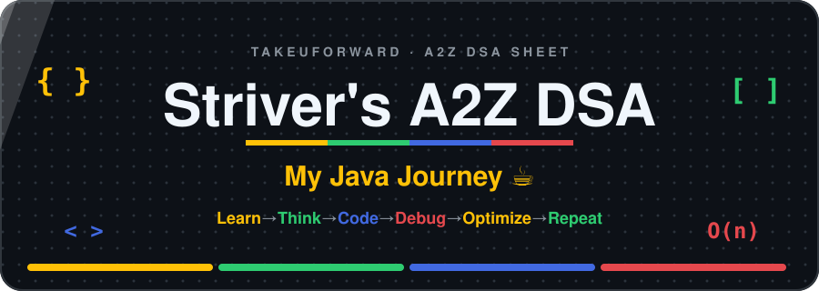
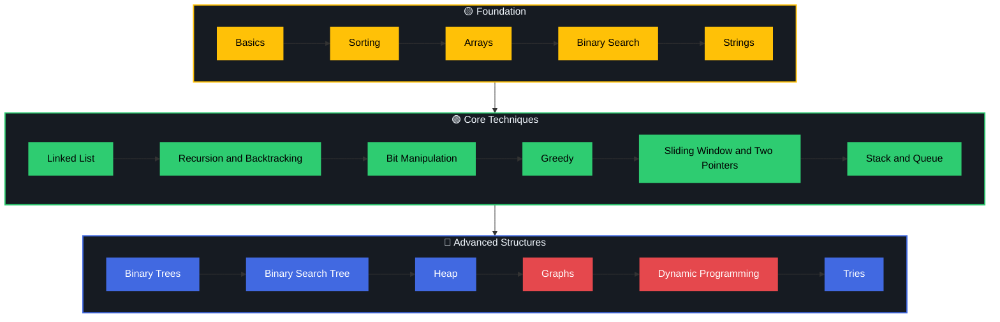
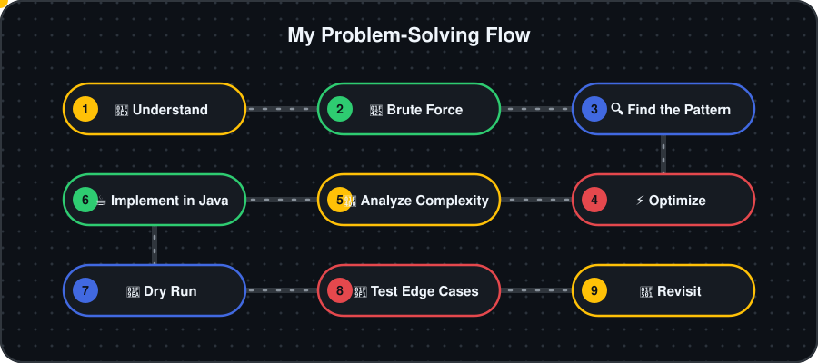
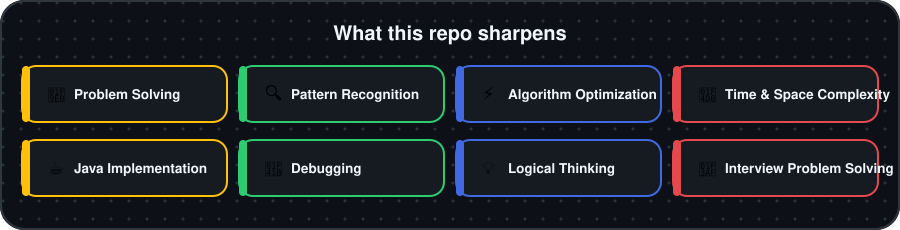
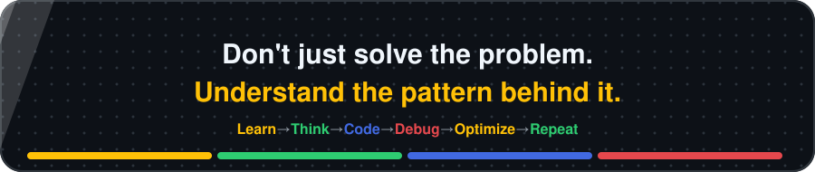

<div align="center">



<br/>


[](https://git.io/typing-svg)

**[🔗 Profiles](#profiles) · [📖 About](#about) · [🧭 Roadmap](#roadmap) · [📂 Structure](#structure) · [☕ Java Toolkit](#toolkit) · [🧩 Approach](#approach) · [📚 Resources](#resources)**

</div>


<a id="profiles"></a>


<div align="center">

<table>
<tr>
<td align="center" width="240">
<a href="https://takeuforward.org/profile/divyansh1502"></a><br/><br/>
<b>🔴 TakeUForward</b><br/><a href="https://takeuforward.org/profile/divyansh1502">divyansh1502</a>
</td>
<td align="center" width="240">
<a href="https://leetcode.com/u/divyansh_5ingh/"></a><br/><br/>
<b>🟡 LeetCode</b><br/><a href="https://leetcode.com/u/divyansh_5ingh/">divyansh_5ingh</a>
</td>
<td align="center" width="240">
<a href="https://www.geeksforgeeks.org/profile/divyansh1502"></a><br/><br/>
<b>🟢 GeeksforGeeks</b><br/><a href="https://www.geeksforgeeks.org/profile/divyansh1502">divyansh1502</a>
</td>
</tr>
</table>

</div>


<a id="about"></a>


This repository contains my **Java implementations and practice** from **Striver's A2Z DSA Sheet by TakeUForward**.

The goal: strong foundations in **Data Structures & Algorithms**, sharper problem-solving, instant pattern recognition, and interview-ready fundamentals.

> [!NOTE]
> Every solution here is written and understood by me. The point is to know **why** an approach works, not to collect accepted submissions.


<a id="roadmap"></a>


<div align="center">

</div>

<br/>

| Section | Pattern / Topic | What it covers |
| :-- | :-- | :-- |
| 🟡 `01` | **[Fundamentals](./Basics/)** | Programming Basics · Time & Space Complexity · Basic Mathematics · Basic Recursion · Basic Hashing |
| 🟢 `02` | **[Sorting](./Sorting/)** | Selection · Bubble · Insertion · Merge · Quick · Recursive Sorting |
| 🔵 `03` | **[Arrays](./Arrays/)** | Easy / Medium / Hard Problems · Prefix Sum · Kadane's Algorithm · Majority Element · Rearrangement · Matrix Problems |
| 🔴 `04` | **[Binary Search](./Binary-Search/)** | Binary Search · Lower Bound · Upper Bound · Search in Rotated Array · Search on Answer · Advanced Problems |
| 🟡 `05` | **[Strings](./Strings/)** | Basic Problems · String Manipulation · String Hashing · Advanced String Problems |
| 🟢 `06` | **[Linked List](./Linked-List/)** | Singly · Doubly · Fast & Slow Pointer · Reversal · Cycle Detection · Advanced Problems |
| 🔵 `07` | **[Recursion & Backtracking](./Recursion-and-Backtracking/)** | Recursion Basics · Subsequences · Subsets · Permutations · Combination Problems · Backtracking |
| 🔴 `08` | **[Bit Manipulation](./Bit-Manipulation/)** | Bitwise Operators · XOR · Bit Masks · Power of Two · Set Bits · Advanced Bit Problems |
| 🟡 `09` | **[Greedy](./Greedy/)** | Greedy Techniques · Activity Selection · Fractional Knapsack · Scheduling · Interval Problems |
| 🟢 `10` | **[Sliding Window & Two Pointers](./Sliding-Window-and-Two-Pointers/)** | Fixed Window · Variable Window · Two Pointer Technique · Subarray Problems · String Window Problems |
| 🔵 `11` | **[Stack & Queue](./Stack-and-Queue/)** | Stack · Queue · Monotonic Stack · Monotonic Queue · Expression Problems · Implementation Problems |
| 🔴 `12` | **[Binary Trees](./Binary-Trees/)** | Traversals · DFS · BFS · Height & Diameter · Views · Lowest Common Ancestor · Advanced Problems |
| 🟡 `13` | **[Binary Search Tree](./Binary-Search-Tree/)** | Operations · Search · Insert · Delete · Validation · Kth Smallest/Largest · LCA |
| 🟢 `14` | **[Heap](./Heap/)** | Priority Queue · Min Heap · Max Heap · Heap Sort · Kth Largest/Smallest · Top K Problems |
| 🔵 `15` | **[Graphs](./Graphs/)** | Representation · BFS · DFS · Connected Components · Cycle Detection · Topological Sort · Shortest Path · MST · DSU |
| 🔴 `16` | **[Dynamic Programming](./Dynamic-Programming/)** | DP Basics · 1D · 2D · Subsequence DP · Knapsack · Grid DP · String DP · Partition DP |
| 🟡 `17` | **[Tries](./Tries/)** | Trie Implementation · Prefix Search · XOR Trie · Advanced Trie Problems |

<a id="path"></a>


The sheet builds in layers: foundations first, then core techniques, then advanced structures.




<a id="structure"></a>


```text
Striver-A2Z/
│
├── 📂 assets/                     ← banner, section SVGs and platform icons
│   ├── takeUforward.jpg
│   ├── leetcode.png
│   └── gfg.png
│
├── 📂 Basics/
├── 📂 Sorting/
├── 📂 Arrays/
├── 📂 Binary-Search/
├── 📂 Strings/
├── 📂 Linked-List/
├── 📂 Recursion-and-Backtracking/
├── 📂 Bit-Manipulation/
├── 📂 Greedy/
├── 📂 Sliding-Window-and-Two-Pointers/
├── 📂 Stack-and-Queue/
├── 📂 Binary-Trees/
├── 📂 Binary-Search-Tree/
├── 📂 Heap/
├── 📂 Graphs/
├── 📂 Dynamic-Programming/
├── 📂 Tries/
│
└── 📄 README.md
```

<a id="stack"></a>


<p align="center">
  
</p>

**Primary language:** Java  ·  **Tools:** Git · GitHub · IntelliJ IDEA · VS Code


<a id="toolkit"></a>


### 🧰 Which Java class for which job?

| I need… | Use | Why |
| :-- | :-- | :-- |
| Resizable array | `ArrayList<Integer>` | `O(1)` index, amortized `O(1)` add |
| Key → value | `HashMap` · `TreeMap` · `LinkedHashMap` | unordered · sorted keys · insertion order |
| Unique elements | `HashSet` · `TreeSet` | unordered `O(1)` · sorted `O(log n)` |
| Stack | `ArrayDeque` (`push` / `pop`) | faster than legacy `Stack` |
| Queue / Deque | `ArrayDeque` | `O(1)` at both ends |
| Min heap | `PriorityQueue<Integer>` | `O(log n)` insert / poll |
| Max heap | `new PriorityQueue<>(Collections.reverseOrder())` | reverse the comparator |
| Mutable string | `StringBuilder` | avoids `O(n²)` string concatenation |

<details>
<summary><b>⚠️ Java pitfalls that cost me WA / TLE</b></summary>

```java
// 1. Overflow-safe midpoint
int mid = low + (high - low) / 2;

// 2. Overflow-safe comparator (never use a[0] - b[0])
Arrays.sort(intervals, (a, b) -> Integer.compare(a[0], b[0]));

// 3. Promote to long BEFORE multiplying
long product = 1L * a * b;

// 4. Compare boxed Integers with equals, not ==
Integer x = 1000, y = 1000;
boolean same = x.equals(y);        // true  (x == y can be false)

// 5. Build strings with StringBuilder inside loops
StringBuilder sb = new StringBuilder();
for (char c : arr) sb.append(c);
```

</details>

<details>
<summary><b>⚡ Fast input template</b></summary>

```java
import java.io.*;
import java.util.*;

public class Main {
    public static void main(String[] args) throws IOException {
        BufferedReader br = new BufferedReader(new InputStreamReader(System.in));
        int n = Integer.parseInt(br.readLine().trim());
        StringTokenizer st = new StringTokenizer(br.readLine());
        int[] a = new int[n];
        for (int i = 0; i < n; i++) a[i] = Integer.parseInt(st.nextToken());
        // solve...
    }
}
```

</details>

<details>
<summary><b>📈 Complexity cheat sheet</b></summary>

| Operation | Time |
| :-- | :-: |
| HashMap / HashSet get, put (average) | `O(1)` |
| TreeMap / TreeSet / PriorityQueue insert | `O(log n)` |
| Binary search | `O(log n)` |
| Merge sort / `Arrays.sort(Object[])` | `O(n log n)` |
| Quick sort (average) | `O(n log n)` |
| Two pointers / sliding window | `O(n)` |
| BFS / DFS on a graph | `O(V + E)` |
| Subsets / permutations | `O(2ⁿ)` / `O(n!)` |

</details>

<a id="approach"></a>


<div align="center">

</div>

<br/>

### 💡 Solution File Header

```java
// Problem  : <name>
// Link     : <leetcode / gfg / tuf url>
// Section  : <A2Z section>
// Pattern  : <pattern used>
// Time     : O(?)
// Space    : O(?)
```


<a id="building"></a>


<div align="center">

</div>


<a id="resources"></a>


| Resource | Link |
| :-- | :-- |
| 🎓 Striver's A2Z DSA Sheet | [takeuforward.org/prep-hub/strivers-a2z-dsa-sheet](https://takeuforward.org/prep-hub/strivers-a2z-dsa-sheet) |
| 🔴 TakeUForward | [takeuforward.org](https://takeuforward.org/) · [my profile](https://takeuforward.org/profile/divyansh1502) |
| 🟡 LeetCode | [leetcode.com](https://leetcode.com/) · [my profile](https://leetcode.com/u/divyansh_5ingh/) |
| 🟢 GeeksforGeeks | [geeksforgeeks.org](https://www.geeksforgeeks.org/) · [my profile](https://www.geeksforgeeks.org/profile/divyansh1502) |

<a id="disclaimer"></a>


This is my personal learning repository containing my own implementations while following **Striver's A2Z DSA roadmap**. The original roadmap and learning resources belong to **Striver / TakeUForward**.

<br/>

<div align="center">

</div>